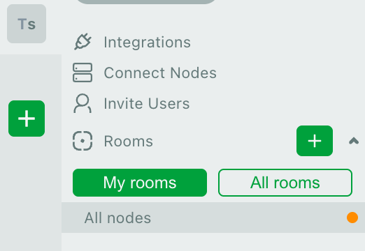
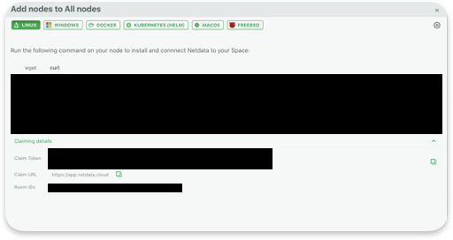
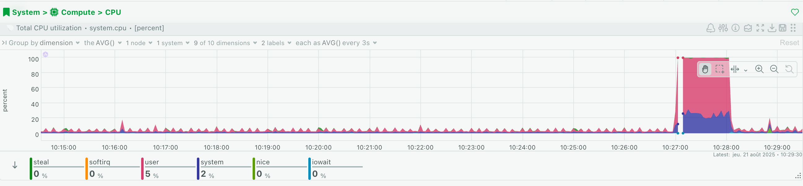
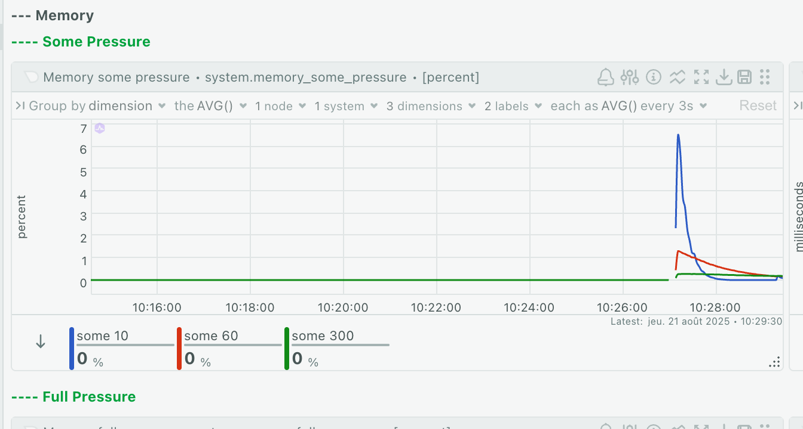
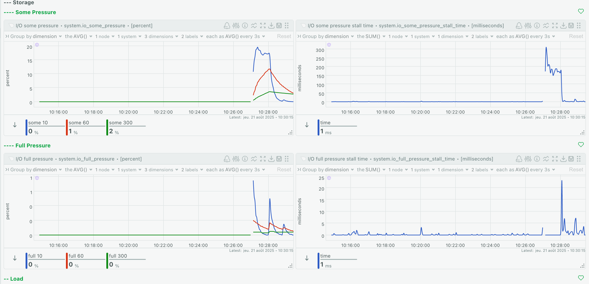
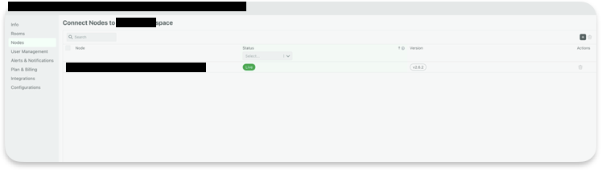

# Simple Monitoring  

This project is based on [roadmap.sh](https://roadmap.sh/projects/simple-monitoring-dashboard) — *Simple Monitoring Dashboard*.  

The goal is to install and configure [Netdata](https://www.netdata.cloud/) on a remote Linux server for monitoring.  

## Requirements  

- ✅ A Linux server with **sudo** access  
- ✅ SSH access to the server  
- ✅ A free [Netdata](https://www.netdata.cloud/) account  


## Installation & Setup  

Normally, Netdata can be installed by running the command provided in the [official docs](https://learn.netdata.cloud/docs/netdata-agent/installation/linux):  

```bash
curl https://get.netdata.cloud/kickstart.sh | sh -s -- --stable-channel --disable-telemetry
```
For convenience, this project includes a setup script that handles installation and node registration automatically. **DO NOT run this command for now**.

## Adding a Node to Netdata

1.	Log in to your Netdata account.
2.	In the left panel, click Connect Nodes (A popup will appear)
3.	Copy your claim token and room ID from the Claiming details section.
4.	Create and save them in the conf file (ignored by Git for security).



In the `conf` file, you must create 2 variables:
```
# Claim token
CLAIM_TOKEN=[CLAIM TOKEN HERE]

# Room ID
ROOM_ID=[ROOM ID HERE]
```


## Custom CPU Alert

This repo includes a `cpu.conf` file that creates a critical alert if CPU utilization exceeds 80%.


## Stress Testing
To test your monitoring setup, install stress-ng using the script.
Run `stress_test.sh` to simulate high CPU usage and watch the alerts appear in your Netdata dashboard. We will do that later on.

## Deployment
To deploy the project files to your server, use the included `deploy.sh` script (uses rsync).

Add 3 variables to your `conf` file. Customize them as you want
```
# Remote server IPV4 - Specify your server ip
REMOTE_IP=192.0.2.1

# Remote destination path
REMOTE_PATH=/root/netdata/

# Remote username; e.g. root
REMOTE_USER=root
```
From your local host, copy your files to your remote server
```bash
# Making ./deploy.sh executable
chmod +x ./deploy.sh

# Lauching ./deploy.sh
./deploy.sh
```

Once it's done, access your remote server terminal and navigate to the target directory. The following commands will complete the installation and launch a stress test.

```bash
# Make setup executable
chmod +x ./setup.sh

# Run setup
./setup.sh

# Launch stress test
./stress_test.sh
```

Example dashboard screenshots while running stress tests:







## Uninstallation

To remove Netdata from your server, run the included cleanup.sh script:
```bash
./cleanup.sh
```

Also remember to remove the node from your Netdata account:
1.	Go to Space settings → Nodes (Bottom left corner).
2.	Click the 🗑️ icon next to the node.



